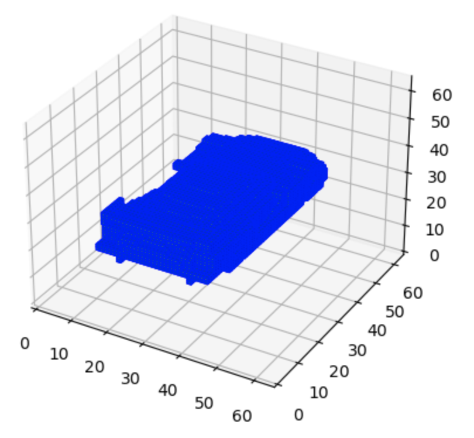
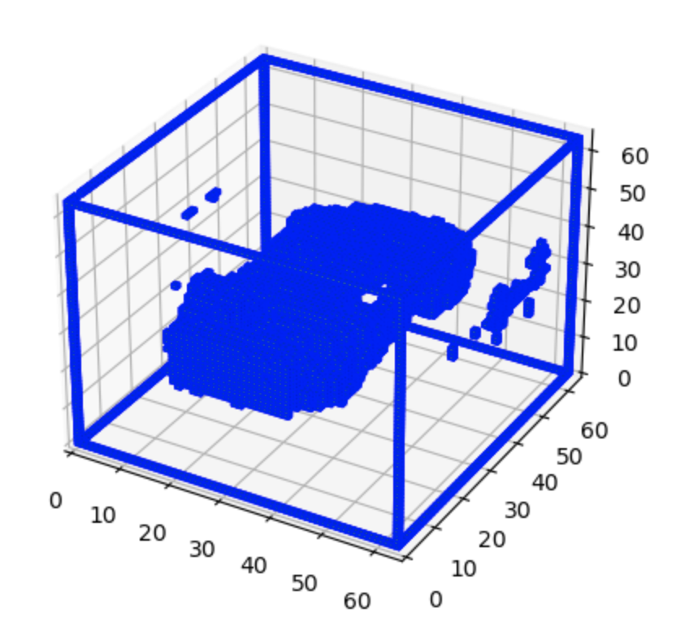
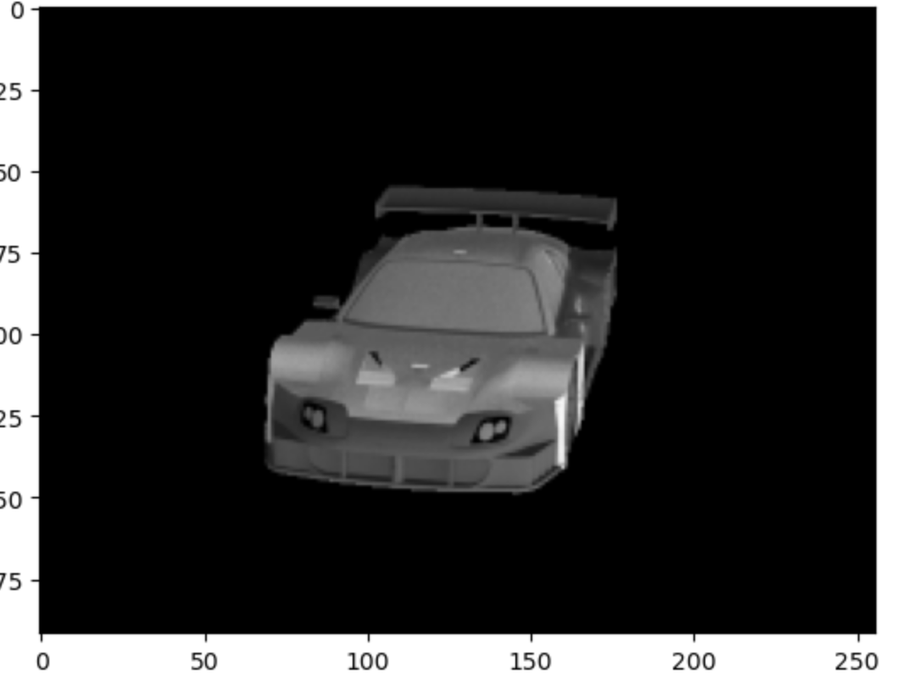
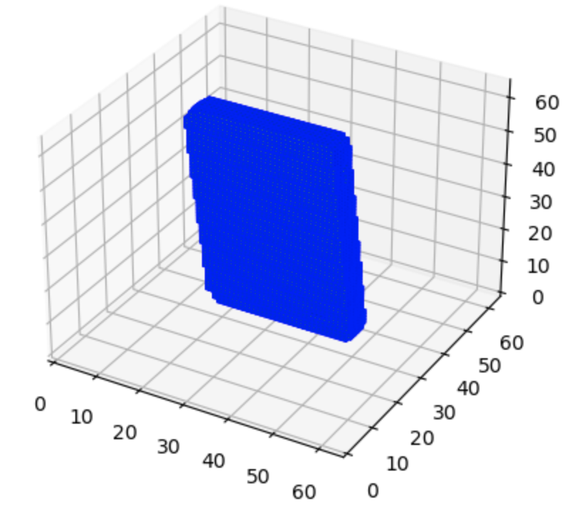
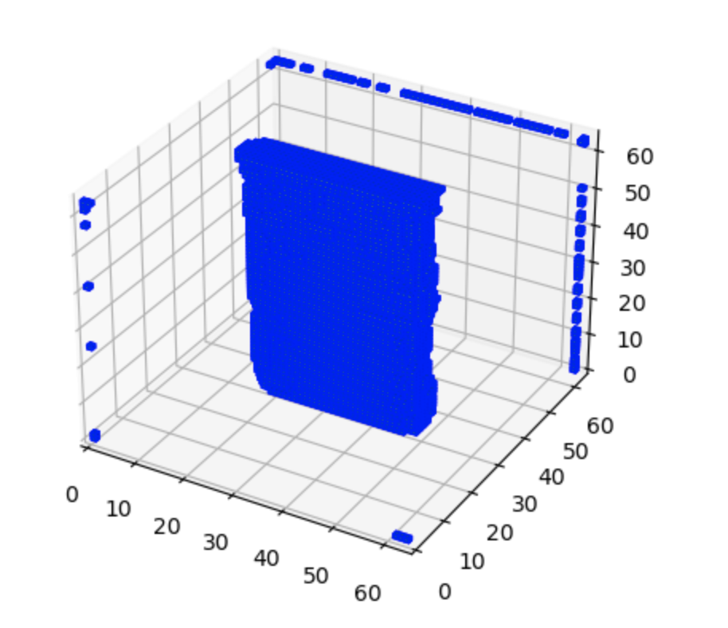
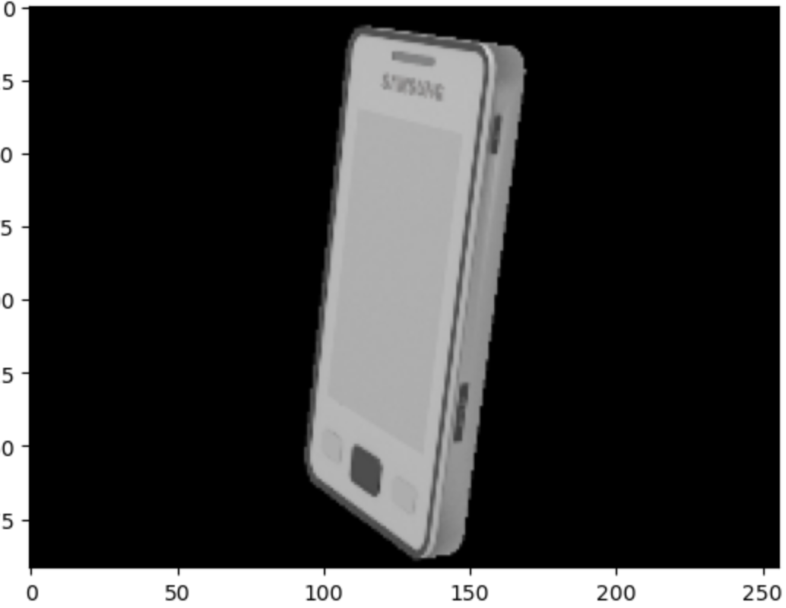

# 3DAttnVAE-GAN

This project focuses on the problem of reconstructing 3D shapes from a single 2D image, utilizing a VAE-GAN model augmented with attention blocks. The model is trained on the ShapeNetCore dataset, which consists of over 48,600 3D models across 55 common categories. I have included a CVPR format latex-typed project description in this repository.
[View detailed project description here](paper_cvpr.pdf)

## Dependencies
  - Python
  - Pytorch
  - einops
  - fancy_einsum
  - sklearn

## Results
 |  | 
 |  | 

fig. 3d image (given), 3d image (generated), 2d image (given) from left to right

## Refrences
  - Angel X Chang, Thomas Funkhouser, Leonidas Guibas, Pat
Hanrahan, Qixing Huang, Zimo Li, Silvio Savarese, Manolis
Savva, Shuran Song, Hao Su, et al. Shapenet: An information-
rich 3d model repository. arXiv preprint arXiv:1512.03012,2015.
    
  - Christopher B. Choy, Danfei Xu, JunYoung Gwak, Kevin
Chen, and Silvio Savarese. 3d-r2n2: A unified approach
for single and multi-view 3d object reconstruction. In Com-
puter Vision–ECCV 2016: 14th European Conference, Ams-
terdam, The Netherlands, October 11-14, 2016, Proceedings,
Part VIII, volume 14. Springer International Publishing, 2016.

  - Haoqiang Fan, Hao Su, and Leonidas J Guibas. A point set
generation network for 3d object reconstruction from a single
image. In Proceedings of the IEEE conference on computer
vision and pattern recognition, pages 605–613, 2017. 4

 - Thibault Groueix, Matthew Fisher, Vladimir G Kim, Bryan C
Russell, and Mathieu Aubry. A papier-mˆach ́e approach to
learning 3d surface generation. In Proceedings of the IEEE
conference on computer vision and pattern recognition, pages
216–224, 2018.

  - Xingyuan Sun, Jiajun Wu, Xiuming Zhang, Zhoutong Zhang,
Chengkai Zhang, Tianfan Xue, Joshua B Tenenbaum, and
William T Freeman. Pix3d: Dataset and methods for single-
image 3d shape modeling. In IEEE Conference on Computer
Vision and Pattern Recognition (CVPR), 2018. 1, 3, 4

  - Shubham Tulsiani, Richard Tucker, and Noah Snavely. Multi-
view supervision for single-view reconstruction via differen-
tiable ray consistency. In Proceedings of the IEEE conference
on computer vision and pattern recognition, 2017. 4
